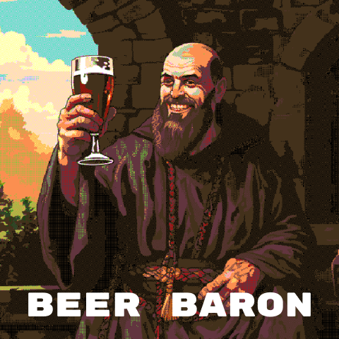

## **Beer Baron** - The Game Guide

An onchain simulation masked as a beer brewing game.

### **Overview:**

In the game of Beer Baron, you step into the shoes of a monk with a flair for entrepreneurship. Hailing from an unknown Realm, your primary resource is a humble sum of 1000 gold. With this capital, you must use your abacus to navigate the hop market, grow hop flowers, brew beer, and sell it to the traverns to make a profit. The game is played over a period of 2 weeks, with the player with the largest fortune at the end of the game being crowned the winner.

### **Novel Game Mechanics:**

- **Hop Market**: Hop market is based on a Logistic VRGDA
- **Farmland**: Farmland is limited, choose what you hop flowers to grow wisely.
- **Brewing**: Each beer recipe is unique blend of hop flowers
- **Selling**: The beer market is an inverse VRGDA, meaning the more you sell into it the cheaper it becomes. So it is best to brew the right beer and sell at the right time to maximise your profits.
- **Winning**: After 2 weeks the markets will close, the player with the biggest pile of Gold takes the entry fee.

### **Game Mechanics:**

1. **Hop Market**:
- Logistic VRGDA auction dictates the price of the hop. Each hop type is sold on the Market and the price is driven by the VRGDA. 

2. **Farmland**:
- Fixed amount of Land to grow your Hops, choose wisely, you are limited in what you can grow.

3. **Brewing**:
- Different recipes for different beers. Each recipe requires a different combination of hops.

4. **Selling**:
- Sell your beer into the market to increase your sheckles. The beer market is an inverse VRGDA, meaning the more you sell into it the cheaper it becomes. Brew the right been and sell at the right time to maximise your profits.

### Technology Stack:

- Dojo Engine
- React App
- RECs ECS library


### Other notable features:

- **Dynamic games**: Contracts have been designed to handle many games at once, and players can choose to modifiy the game parameters to suit their needs.
- **Game lobby**: Contracts include a basic Lobby system, where players can find games.
- **Optimistic client updates**: Where possible the game optimistically updates the client before resolving the transaction.


### TODO:

- Complete token logic
- Clean up logic
- Include burner wallet


### Launch the Example in Under 30 Seconds

After cloning the project, execute the following:

1. **Terminal 1 - Katana**:

```console
cd contracts && katana --disable-fee --block-time 1
```

2. **Terminal 2 - Contracts**:

```console
cd contracts && sozo build && sozo migrate
```

3. **Terminal 3 - Client**:

```console
cd client && yarn && yarn dev
```

Upon completion, launch your browser and navigate to http://localhost:5173/. You'll be greeted by the running example!